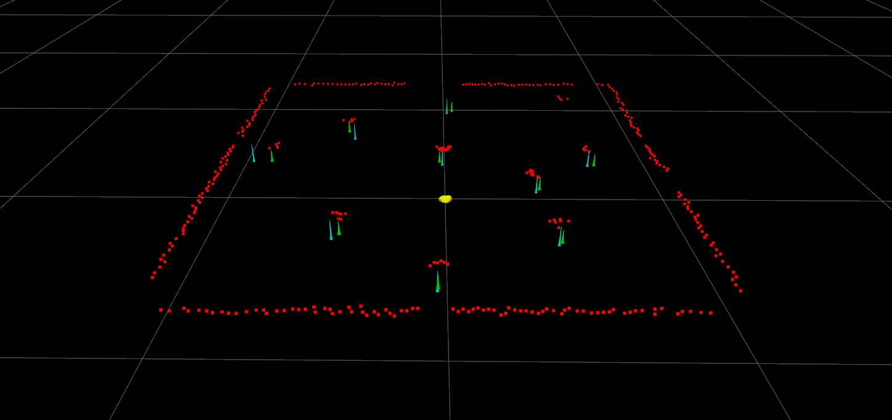

# 2d-landmark-slam
ROS 2 package for 2D landmark SLAM using FastSLAM 2.0.



# Building from source
Follow these steps to build using colcon:
```
mkdir -p slam_ws/src && cd slam_ws/src
git clone https://github.com/atharva-18/landmark-slam-2d.git
cd ..
colcon build
```

To source the setup, please run:
```
source ./install/setup.bash # If using bash
source ./install/setup.zsh # If using zsh
```

# Running the package
Run using ROS command line tools:
```
ros2 launch landmark_slam_2d slam.launch.py
```

# Subscribed topics
* /perception/landmark_detections
Message of type geometry_msgs/Polygon. Holds all detected 2D landmarks.

* /estimation/slam/state
Message of type geometry_msgs/Twist. Holds linear and angular velocity data in body/base_link frame.

# Published topics
* /estimation/slam/map
Message of type geometry_msgs/Polygon. Holds all estimated landmark positions in the map.

* /estimation/slam/pose
Message of type geometry_msgs/Pose2D. Holds the estimated 2D pose of the robot.

* /estimation/visualization/map
Message of type visualization_msgs/MarkerArray. Holds the markers required by RViz.

# Footnotes
This package is intended to work on ROS 2 Foxy with Ubuntu 20.04, however, Rolling should also work. Please note that this algorithm is not tested on a real robot.
